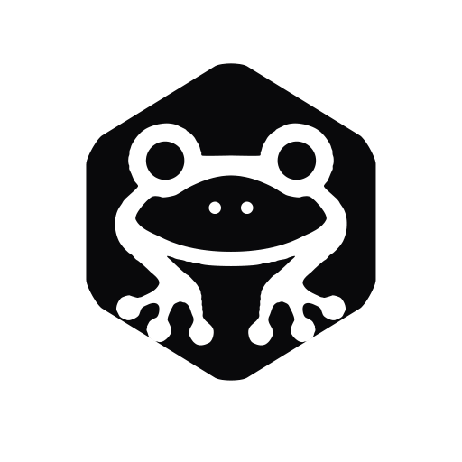

# FrogUI

<p align="center">
  
</p>

<p align="center">
  <strong>Composable components for modern Android.</strong><br>
  <em>Beautifully engineered Android components. Open. Customizable. Native.</em>
</p>

<p align="center">
  <a href="#brand-identity">Brand Identity</a> •
  <a href="#features">Features</a> •
  <a href="#quick-start">Quick Start</a> •
  <a href="#architecture">Architecture</a> •
  <a href="#roadmap">Roadmap</a> •
  <a href="#contributing">Contributing</a>
</p>

---

## Brand Identity

FrogUI adopts a **restrained, modern monochrome visual philosophy** tailored specifically for developer tools and production-grade Android applications.

* **Palette**: Strict monochrome foundation (Zinc `#09090B`, `#18181B`, `#27272A`, `#FFFFFF`) with intentional contrast over arbitrary color.
* **Vector Assets**: 100% vector-first with symmetrical cubic Bézier paths. Zero bitmap dependencies.
* **Adaptive Icons**: Full support for Android adaptive launcher icons (Circle, Squircle, Rounded Square) with 0px clipping safe-zone compliance.
* **Themed Icons**: Android 13+ Material You dynamic monochrome icon support.
* **Native Splash**: Android 12+ SplashScreen API integration.

---

## Features

* **Own Your UI**: Caller-owned state, native Compose slots and modifiers, and semantic theme customization.
* **Zero Mascots**: A minimal geometric software-product mark engineered for serious developer tooling.
* **Accessibility Contract**: Required semantics, font scaling, contrast, focus, and touch-target verification before a component becomes stable.
* **Edge-to-Edge Native**: Full modern Android edge-to-edge support with `WindowInsets` awareness.
* **Responsive Layouts**: Designed for adaptive screens from 360dp compact phones to expanded tablet multi-column inspector layouts.

---

## Quick Start

FrogUI is pre-release. Button is **Experimental** and is being completed as the
architectural reference. IconButton exists in source but awaits a dedicated discovery
contract. Other components remain roadmap items. No stable component certification
or published Maven artifact is implied by these examples; use local project dependencies.

### 1. Theme Configuration

Wrap your application in `FrogTheme`:

```kotlin
import io.github.codewitheswar.frogui.theme.FrogTheme

class MainActivity : ComponentActivity() {
    override fun onCreate(savedInstanceState: Bundle?) {
        super.onCreate(savedInstanceState)
        enableEdgeToEdge()
        setContent {
            FrogTheme(darkTheme = true) {
                MainContent()
            }
        }
    }
}
```

### 2. Using FrogButton

```kotlin
import io.github.codewitheswar.frogui.components.button.FrogButton
import io.github.codewitheswar.frogui.components.button.FrogButtonSize
import io.github.codewitheswar.frogui.components.button.FrogButtonVariant

// Primary button
FrogButton(
    variant = FrogButtonVariant.Primary,
    size = FrogButtonSize.Medium,
    onClick = { /* Handle action */ }
) {
    Text("Continue")
}

// Loading state
FrogButton(
    variant = FrogButtonVariant.Secondary,
    loading = true,
    onClick = { }
) {
    Text("Saving...")
}
```

### 3. Branding ownership

Branding composables and Android logo resources belong to the Showcase app. They
are not part of the reusable library API. Shared brand source artwork lives in `art/`.

---

## Architecture

The [product contract](docs/architecture/product-contract.md) defines FrogUI's
engineering principles and v1 boundaries. Read it before designing APIs or adding
scope. The [architecture ADRs](docs/architecture/system-overview.md#flows-and-decisions)
cover Compose-only UI, metadata-only registry, canonical native Showcase, and Maven-first
distribution. See the [component lifecycle](docs/architecture/component-lifecycle.md)
for the evidence required to mark a component Stable.

FrogUI is structured into separate Android modules:

```text
FrogUI/
├── frogui-foundation/          # Token models, graphics/text, shapes and motion; no Material
├── frogui-theme/               # FrogTheme, internal locals, resolvers, Material bridge
├── frogui-components/          # Pure Compose UI components (FrogButton, FrogIconButton, etc.)
├── frogui-registry/            # Native metadata generated from registry JSON, search, categories
├── frogui-testing/             # Shared Compose test fixture; test dependencies only
├── build-logic/                # Library and local-publication convention plugins
├── tools/registry/             # Shared schemas, validation and metadata generation
├── docs/                       # Architecture/prose and generated catalog/search data
├── app/                        # Adaptive showcase application & interactive workbench
│   └── src/main/java/.../
│       ├── navigation/         # Adaptive phone/tablet navigation shell
│       ├── showcase/canvas/    # ComponentPreviewCanvas with isolated theme switching
│       ├── showcase/components/button/ # Button screen, inspector, state and compiled examples
│       └── showcase/screens/   # Home, Components, Detail Workbench, Foundation, About
└── gradle/                     # Version catalog and Gradle build configuration
```

---

## Component Roadmap

- [x] **Brand & Vector System** (`frogui_mark`, `frogui_logo`, adaptive & themed icons, splash)
- [x] **Design Tokens** (Zinc monochrome color palette, semantic typography, elevation, spacing, motion)
- [x] **Layered Architecture** (foundation, theme, components, registry, test support, app)
- [ ] **Stable Reference Button** (existing Button/IconButton source; API, device accessibility, motion, previews, and documentation evidence still required)
- [x] **Component Playground & Interactive Inspector** (Independent theme canvas, responsive width presets, live code generator)
- [x] **Canonical Registry & Discovery** (Generated native metadata, category filtering, search, contract checks)
- [ ] **Inputs** (`FrogTextField`, `FrogCheckbox`, `FrogRadio`, `FrogSwitch`)
- [ ] **Data Display** (`FrogCard`, `FrogBadge`, `FrogAvatar`, `FrogDivider`)
- [ ] **Overlays & Feedback** (`FrogDialog`, `FrogBottomSheet`, `FrogAlert`, `FrogTooltip`)
- [ ] **Navigation Primitives** (`FrogTopBar`, `FrogTabs`, `FrogSegmentedControl`, `FrogNavigationRail`)
- [ ] **GitHub Pages Documentation**

---

## Contributing

Read [CONTRIBUTING.md](CONTRIBUTING.md) and use the product-contract PR checklist.
Run the relevant available checks and report their actual results:

```bash
npm ci --ignore-scripts
npm test
npm run docs:build
./gradlew verifyArchitecture
./gradlew check
./gradlew verifyProductContract
./gradlew lintDebug
./gradlew testDebugUnitTest
```

---

## License

Apache License 2.0. See [LICENSE](LICENSE) for details.
