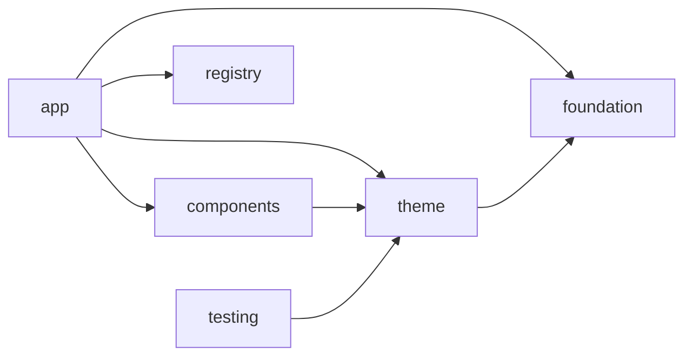

# FrogUI architecture

Read the binding [product contract](product-contract.md). Phase 03 implements the
smallest layered system needed by the current Button reference, not a full catalog.

## Existing and current architecture

Phase 02 had four Android modules: foundation (including theme and brand UI),
components, registry, and app. Registry generated native metadata from JSON; docs
were architecture prose. There was no shared release version, full schema validation,
typed destination coverage, common library convention, or publication configuration.

Phase 03 separates theme and test support, removes duplicate branding/legacy theme
implementations, centralizes library setup, and validates generated native/docs
contracts. Button stays Experimental; IconButton still awaits its discovery contract.

## Module boundaries

| Module/system | Owns | Must not own |
| --- | --- | --- |
| foundation | Semantic token/model types, colors, spacing, shapes, typography, elevation, motion | Material theme bridge, brand UI/resources, app logic |
| theme | FrogTheme, internal CompositionLocals, defaults/resolvers, Material bridge | Components, navigation, business data |
| components | Public Button/IconButton, variants, sizes, defaults, slots, generic accessibility strings | Showcase/demo state, docs, services |
| registry | Generated immutable metadata, categories, search | Compose rendering, runtime JSON, component factories |
| testing | Shared Compose test-theme fixture, used by theme/app Android tests | Consumer production behavior; Maven publication |
| app | Offline catalog, typed routes, real examples, inspector, preview canvas, app branding | Copies of reusable component implementations |
| build-logic | Android library and local-publication conventions | Product/runtime logic |
| tools/registry | Draft-07 schema validation, source/example/route checks, Kotlin/JSON generation | Runtime rendering |
| docs | Prose and generated catalog/search data adapter | AAR/APK processing or Compose runtime |

The app keeps its existing application ID/namespace. Feature code now places Button's
screen, state, inspector, and compilable examples in `showcase/components/button`.
Library Button imports remain `components.button.FrogButton`; token imports remain
`foundation.*`. Theme imports move to `io.github.codewitheswar.frogui.theme`.

## Dependency graph

Arrows mean “depends on.” See [enforced rules](dependency-rules.md).

`testing` is consumed only through test configurations. Components unit tests use
registry for enum parity; theme/app Android tests use testing. No test dependency
flows into a published release runtime. Foundation has no Material dependency.

## Flows and decisions

- [Registry flow](registry-contract.md): source JSON + compiled examples → typed Kotlin and docs JSON.
- [Showcase flow](showcase-flow.md): metadata → explicit native destination → public component.
- [Docs flow](docs-flow.md): generated JSON + prose → catalog/search data; web shell deferred.
- [Testing strategy](testing-strategy.md) and [release flow](release-flow.md).
- [Phase 03 local verification](phase-03-verification.md).
- [0001: Compose](decisions/0001-compose-only-v1.md), [0002: metadata](decisions/0002-registry-metadata.md),
  [0003: native truth](decisions/0003-native-showcase.md), [0004: Maven first](decisions/0004-maven-first-distribution.md),
  [0005: layered modules](decisions/0005-layered-modules.md), [0006: generated adapters](decisions/0006-generated-adapters.md),
  [0007: publication boundary](decisions/0007-publication-boundary.md).

Category modules, patterns, benchmarks, samples, binary API baselines, and visual
golden infrastructure need demonstrated responsibilities before being added.
